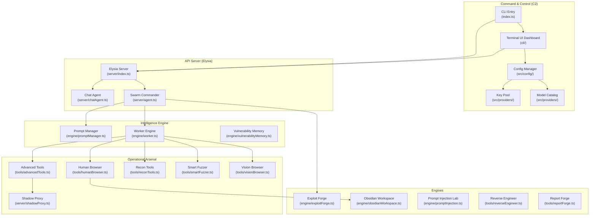
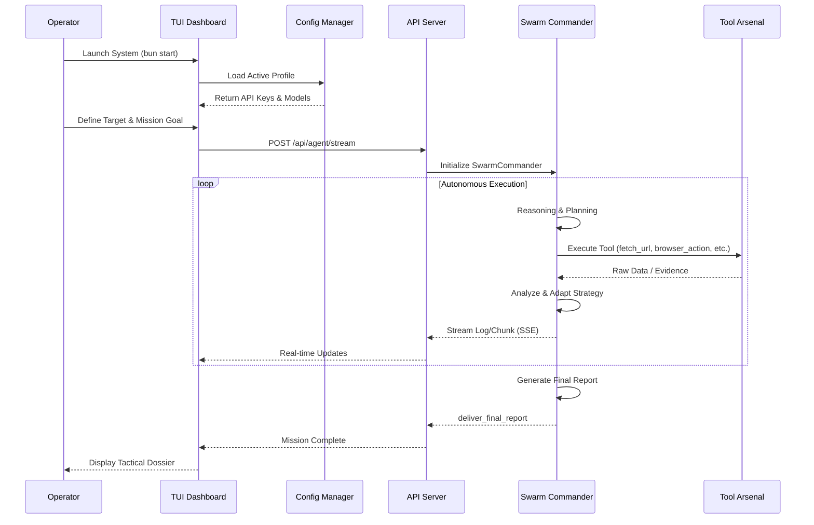
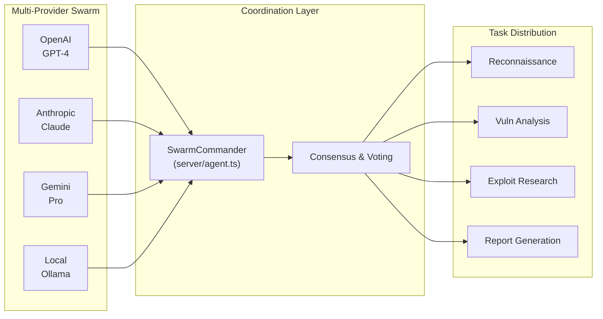

# REDLOCK v3.0.0

## Autonomous Security Intelligence & Swarm Orchestration Platform

REDLOCK is an Autonomous Intelligence Platform designed for Security Research, Vulnerability Analysis, and Systematic Auditing. It utilizes a Decentralized Swarm architecture capable of autonomous decision-making and full-scale operations.

> **Research & Education Advisory**
> This system is engineered for authorized security researchers, auditors, and educators.
> Agents operate with Full Autonomy. Use responsibly and ethically.

---

## System Architecture

The system features a decoupled architecture separating the User Interface (TUI), Policy Control (Config Manager), and Operations (Swarm Engine).



---

## Operational Workflow

The operational flow of REDLOCK from mission initiation to tactical report delivery.



---

## Swarm Intelligence Concept



---

## Key Features (v3.0.0)

### Core Capabilities

- **Multi-Provider Swarm Intelligence**: Utilize multiple AI Providers simultaneously for consensus-based analysis (OpenAI, Anthropic, Gemini, Ollama, KiloCode, OpenCode, Cline, Groq, Mistral, xAI, OpenRouter).
- **Full Autonomy Agent**: Agents independently select tools and plan strategies without human intervention.
- **Advanced TUI Dashboard**: Ink-based Terminal UI with real-time streaming logs.
- **Elysia API Server**: RESTful API with Server-Sent Events (SSE) for streaming responses.
- **Shadow Proxy**: MITM proxy for traffic interception and modification.
- **Stealth Browser**: Playwright-based browser with anti-detection capabilities.

### Security Research Tools

- **Wappalyzer Integration**: Automatic technology detection (CMS, Frameworks, Analytics).
- **Advanced Reconnaissance**: DNS, port scanning, HTTP header auditing, SSL inspection.
- **Secret Scanner**: Scan for leaked secrets and API keys.
- **Smart Fuzzer**: Automated vulnerability fuzzing.
- **Vision Browser**: OCR and visual UI analysis capabilities.
- **CVE Search**: Search and analyze known vulnerabilities.
- **Exploit Forge**: Payload generation and obfuscation.
- **Report Forge**: Professional report generation.
- **Reverse Engineer**: Code analysis and reverse engineering.
- **Prompt Injection Lab**: Test prompt injection attack vectors.
- **SSRF Probe**: Server-Side Request Forgery testing.

### Training & Research

- **Obsidian Integration**: Record findings and create attack maps in an Obsidian vault.
- **AI Browser Controller**: Research module for automated browser-based attacks.
- **Vulnerability Memory**: Persistent database of discovered vulnerabilities.

---

## What's New in v3.0.0

### Major Enhancements

| Feature | Description | Status |
|---------|-------------|--------|
| **Multi-Provider Support** | OpenAI, Anthropic, Gemini, Ollama, KiloCode, OpenCode, Cline, Groq, Mistral, xAI, OpenRouter | Added |
| **Wappalyzer Core Integration** | Automatic technology detection (CMS, Frameworks, Analytics) | Added |
| **Shadow Proxy** | MITM proxy for traffic interception | Added |
| **Vision Browser** | OCR and visual UI analysis capabilities | Added |
| **Reverse Engineering Tools** | Code analysis and binary inspection | Added |
| **Advanced Reporting** | Professional report generation with ReportForge | Added |
| **CVE Search** | Known vulnerability database lookup | Added |
| **SSRF Probe** | Server-Side Request Forgery testing tool | Added |
| **Prompt Injection Lab** | Testing environment for prompt injection attacks | Added |

### Technical Improvements

- **Bun Native**: 100% Bun runtime, no Node.js dependencies.
- **TypeScript Strict Mode**: Enhanced type safety across all modules.
- **Elysia Framework**: High-performance API server with type safety.
- **Playwright Stealth**: Anti-detection browser automation.
- **p-limit Concurrency**: Controlled parallel execution.

---

## Technology Stack

| Component | Technology |
|-----------|------------|
| **Runtime** | Bun (100% Native TypeScript/JavaScript) |
| **TUI Framework** | Ink (React-based Terminal UI) |
| **API Server** | Elysia (TypeScript web framework) |
| **AI Providers** | Multi-Model (OpenAI, Anthropic, Gemini, Ollama, and more) |
| **Browser Automation** | Playwright (Chromium) with Anti-Detection |
| **State Management** | In-memory + Obsidian vault integration |
| **Database** | SQL.js (SQLite in browser/Node) |

---

## Installation & Quick Start

### Prerequisites

- Bun runtime installed.
- API keys for at least one AI provider (OpenAI/Anthropic/Gemini).

### 1. Install Dependencies

```bash
bun install
```

### 2. Configure Environment

Copy `.env.example` to `.env` and fill in your API keys:

```bash
cp .env.example .env
```

Or edit `.env` directly:

```bash
# Minimal .env example
OPENAI_API_KEY=sk-your-key-here
DEFAULT_PROVIDER=openai
```

### 3. Start the System

#### Option A: CLI Mode (Recommended)

```bash
bun start
```
Launches the animated CLI and TUI Dashboard.

#### Option B: API Server Only

```bash
bun run server
```
Starts the Elysia API server on port 4040.

#### Option C: TUI Only

```bash
bun run tui
```
Directly launch the Terminal UI (requires server running).

---

## Usage Guide

### TUI Dashboard Navigation

```
Main Menu:
├── [ START MISSION ] → Start new mission
├── [ CONFIGURE ]    → Manage Profiles (API Keys, Models)
└── [ EXIT ]         → Exit system
```

### Starting a Mission

1. From the TUI, select **START MISSION**.
2. Specify Target (URL or IP).
3. Specify Goal (audit objective).
4. Press Enter to start the mission.

The Agent will operate autonomously and stream results in real-time via SSE.

### API Usage (Programmatic)

```bash
# Start a mission via API
curl -X POST http://localhost:4040/api/agent/stream \
  -H "Content-Type: application/json" \
  -d '{
    "url": "https://target.com",
    "goal": "Find SQL injection vulnerabilities",
    "provider": "openai",
    "model": "gpt-4",
    "browserVisible": false
  }'
```

---

## Agent Tool Arsenal

### Core Tools (server/tools.json)

| Tool | Description | Category |
|------|-------------|----------|
| `fetch_url` | Visit URL and return page snapshot | Recon |
| `dns_recon` | DNS reconnaissance on host | Recon |
| `http_header_audit` | Audit HTTP security headers | Security |
| `ssl_inspect` | Inspect SSL/TLS certificate | Security |
| `secret_scanner` | Scan for leaked secrets/keys | Security |
| `port_probe` | Scan common ports | Recon |
| `web_spider` | Map website structure | Recon |
| `browser_action` | Interactive browser control | Browser |
| `wayback_lookup` | Historical URLs via Wayback Machine | OSINT |
| `record_vulnerability` | Record vuln in persistent memory | Reporting |
| `deliver_final_report` | Generate tactical dossier | Reporting |
| `get_technique_blueprint` | Get security technique research | Research |

### Advanced Tools (tools/ directory)

- **advancedTools.ts**: Exploit forging, payload generation.
- **humanBrowser.ts**: Stealth browser with Playwright.
- **reconTools.ts**: Network reconnaissance tools.
- **smartFuzzer.ts**: Automated vulnerability fuzzing.
- **visionBrowser.ts**: Visual UI analysis with OCR.
- **reverseEngineer.ts**: Code analysis and reverse engineering.
- **redteam.ts**: Red team attack simulations.
- **reportForge.ts**: Professional report generation.
- **cveSearch.ts**: CVE database search and analysis.
- **ssrfProbe.ts**: Server-Side Request Forgery probing.
- **sseParser.ts**: SSE stream parsing utilities.

### Engine Modules (engine/ directory)

- **promptManager.ts**: Prompt templates and management.
- **exploitForge.ts**: Exploit generation and obfuscation.
- **vulnerabilityMemory.ts**: Persistent vulnerability database.
- **obsidianWorkspace.ts**: Obsidian vault integration.
- **promptInjection.ts**: Prompt injection testing lab.
- **cacheManager.ts**: Response and data caching.
- **worker.ts**: Background worker engine.

---

## Project Structure

```
REDLOCK/
├── index.ts                     # CLI Entry Point
├── package.json                 # Project manifest
├── tsconfig.json               # TypeScript configuration
├── .env.example                # Environment template
├── .gitignore                  # Git ignore rules
│
├── server/
│   ├── index.ts               # Elysia API Server
│   ├── agent.ts               # SwarmCommander Runtime
│   ├── chatAgent.ts           # Chat Session Manager
│   ├── shadowProxy.ts         # MITM Proxy
│   ├── providerUtils.ts       # Provider utilities
│   └── tools.json             # Tool Definitions
│
├── cli/
│   ├── index.tsx              # Ink TUI Dashboard
│   ├── dashboard.tsx          # Dashboard Components
│   ├── tuiHelpers.tsx         # TUI Helper Utilities
│   ├── menu_config.json       # Menu Configuration
│   ├── post_mission_config.json  # Post-Mission Config
│   └── components/            # UI Components
│
├── engine/
│   ├── promptManager.ts       # Prompt Templates
│   ├── worker.ts              # Worker Engine
│   ├── vulnerabilityMemory.ts # Vuln Database
│   ├── exploitForge.ts        # Payload Generator
│   ├── obsidianWorkspace.ts    # Obsidian Integration
│   ├── promptInjection.ts      # Prompt Injection Lab
│   └── cacheManager.ts        # Cache Management
│
├── tools/                     # Agent Tool Arsenal
│   ├── advancedTools.ts
│   ├── humanBrowser.ts
│   ├── reconTools.ts
│   ├── smartFuzzer.ts
│   ├── visionBrowser.ts
│   ├── reverseEngineer.ts
│   ├── redteam.ts
│   ├── reportForge.ts
│   ├── cveSearch.ts
│   ├── ssrfProbe.ts
│   └── sseParser.ts
│
├── src/
│   ├── config/                # Configuration Management
│   ├── providers/              # AI Provider Definitions
│   └── runtime/               # Runtime Utilities
│
├── auth/                      # Authentication Modules
├── assets/                    # Static Assets
├── media/                     # Media Processing
├── public/                    # Public Static Files
├── research/                  # Research Documents
├── plans/                     # Project Plans & Blueprints
└── scratch/                   # Scratch Workspace
```

---

## Development Commands

```bash
# Development mode with hot reload
bun run dev

# Start full system (API + TUI)
bun start

# API Server only
bun run server

# TUI only (requires server running)
bun run tui

# Type checking (MANDATORY before commits)
bun run check

# Run any TypeScript file directly
bun file.ts

# Clean install
bun run clean
```

---

## Supported Providers

| Provider | Default Model | Status |
|----------|--------------|--------|
| OpenAI | gpt-4 | Full |
| Anthropic | claude-sonnet-4-20250514 | Full |
| Gemini | gemini-2.5-flash | Full |
| Ollama | llama3.2 | Full |
| OpenRouter | openai/gpt-4.1-mini | Full |
| Groq | llama-3.3-70b-versatile | Full |
| xAI | grok-4-fast-reasoning | Full |
| Mistral | mistral-medium-latest | Full |
| KiloCode | kilocode/kilo/auto | Full |
| OpenCode | gpt-4o | Full |
| Cline | anthropic/claude-sonnet-4-6 | Full |

---

## Compliance and Liability

This software is created solely for research and authorized security testing purposes. The developers assume no liability for any damages resulting from unauthorized or illegal use.

**Operational Precision. Swarm Intelligence. Zero Summary Laziness. Full Autonomy.**

---

## Version History

### v3.0.0 (2026-04-23)

- **Multi-Provider Expansion**: Added KiloCode, OpenCode, Cline, Groq, Mistral, xAI, OpenRouter support.
- **Wappalyzer Integration**: Technology stack fingerprinting.
- **Shadow Proxy**: MITM proxy for traffic interception.
- **Vision Browser**: OCR and visual analysis.
- **Advanced Tool Arsenal**: 15+ specialized security research tools.
- **Prompt Injection Lab**: Testing environment for AI security.
- **Obsidian Integration**: Persistent memory vault.
- **Elysia API Server**: Modern TypeScript backend with SSE streaming.
- **CVE Search & SSRF Probe**: Extended vulnerability research capabilities.

### v2.0.0 (2026-Q1)

- Elysia API Server with SSE streaming.
- MCP (Model Context Protocol) integration.
- SwarmCommander with multi-provider support.
- Enhanced TUI with Ink.
- Shadow Proxy for MITM capabilities.

### v1.x (2025)

- Initial release with basic agent capabilities.

---

## Contact & Support

- **Repository**: [github.com/JonusNattapong/RedLock](https://github.com/JonusNattapong/RedLock)
- **Issues**: [Report bugs](https://github.com/JonusNattapong/RedLock/issues)
- **Author**: JonusNattapong

---

**Last Updated**: 2026-04-29
**Version**: 3.0.0
