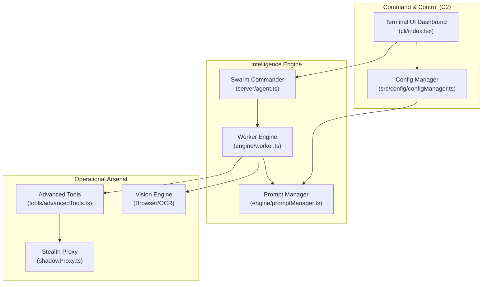
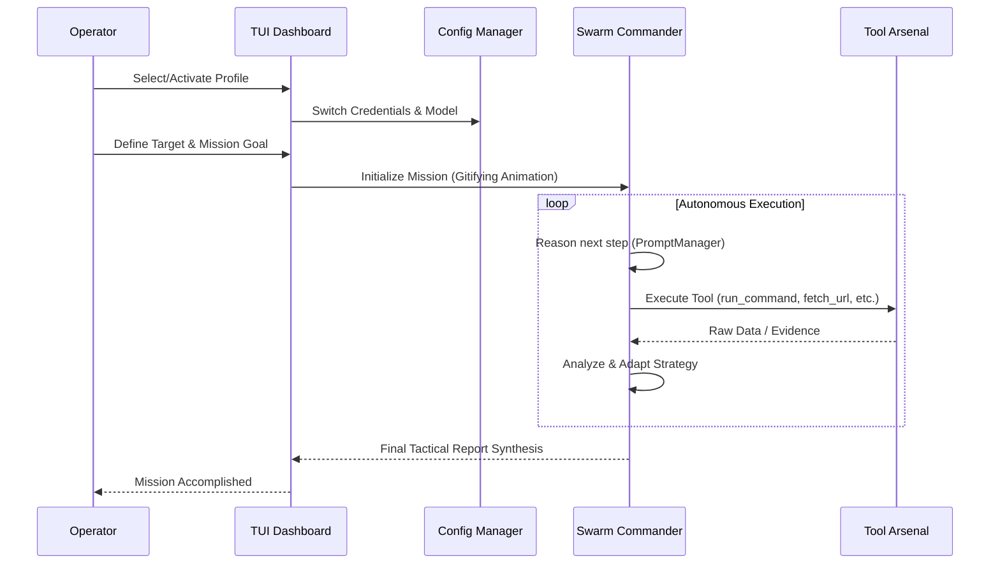

# REDLOCK AuditorAi v3.5.0 🚀

## Autonomous Security Intelligence & Swarm Orchestration Platform

REDLOCK AuditorAi เป็นแพลตฟอร์มความมั่นคงปลอดภัยไซเบอร์แบบอัตโนมัติ (Autonomous Intelligence Platform) ที่ออกแบบมาเพื่อการทำ Advanced Red Teaming, Vulnerability Research และ Systematic Auditing โดยใช้สถาปัตยกรรม **Decentralized Swarm** ที่สามารถตัดสินใจและปฏิบัติการได้เองอย่างเต็มรูปแบบ

> **[!] TACTICAL ADVISORY**
> ระบบนี้ถูกวิศวกรรมมาเพื่อผู้เชี่ยวชาญด้านความมั่นคงปลอดภัยและการตรวจสอบที่ได้รับอนุญาตเท่านั้น 
> การตัดสินใจของ Agent เป็นแบบ Full Autonomy โปรดใช้งานด้วยความระมัดระวังขั้นสูงสุด

---

## 🏗️ System Architecture

ระบบถูกออกแบบมาให้มีการแยกส่วน (Decoupled) ระหว่างส่วนติดต่อผู้ใช้ (TUI), ส่วนควบคุมนโยบาย (Config Manager) และส่วนปฏิบัติการ (Swarm Engine)



---

## 🔄 Operational Workflow

กระบวนการทำงานของ AuditorAi จากการเริ่มภารกิจจนถึงการส่งมอบรายงานเชิงยุทธวิธี



---

## ✨ Key Enhancements (2026 Edition)

*   **Tactical Profile Management**: ระบบจัดการโปรไฟล์ที่ผ่านการ Hardening รองรับการแยก Save, Activate และ Delete พร้อมการแสดงสถานะ Active แบบ High-Visibility (Green/Bold)
*   **Dynamic Mission Loading**: อินเทอร์เฟซแบบ "✛ Gitifying..." ที่ได้รับแรงบันดาลใจจาก Claude Code พร้อมชุดคำกริยาเชิงยุทธวิธีที่เปลี่ยนไปตามเฟรมเวลา
*   **Swarm Autonomy**: Agent สามารถเลือกใช้เครื่องมือ (Tool Invocation) และวางแผนซ้ำได้ด้วยตัวเองจนกว่าภารกิจจะสำเร็จ
*   **Integrated Security Lab**: ห้องทดลองช่องโหว่ 13 รูปแบบ (Port 8080) สำหรับการฝึกฝนและทดสอบ Payload

---

## 🛠️ สถาปัตยกรรมและเทคโนโลยี

*   **Runtime**: [Bun](https://bun.sh) (100% Native TypeScript/JavaScript)
*   **TUI Framework**: [Ink](https://github.com/vadimdemedes/ink) (React-based Terminal Interfaces)
*   **Intelligence Provider**: รองรับ Multi-Model (Anthropic, OpenAI, Gemini, Local Models)
*   **Network Layer**: Playwright (Anti-Detection), Shadow Proxy (MITM), Stealth Engine

---

## 🚀 การใช้งาน (Quick Start)

### 1. ติดตั้ง Dependencies
```bash
bun install
```

### 2. เริ่มต้นระบบ Operational HUD
```bash
bun start
```

### 3. การจัดการโปรไฟล์ (Environment Settings)
*   ใช้ **Arrow Keys / Tab** ในการเลือกฟิลด์ (Name, Provider, API Key, Model)
*   กดปุ่ม **[ SAVE ]** เพื่อบันทึกข้อมูล
*   กดปุ่ม **[ ACTIVATE ]** เพื่อเริ่มใช้งานโปรไฟล์นั้นทันที (ชื่อจะกลายเป็นสีเขียว)
*   กดปุ่ม **[ DELETE ]** เพื่อลบโปรไฟล์ที่ไม่ต้องการ

---

## 📊 รายการเครื่องมือ (Agent Arsenal)

| เครื่องมือ | ความสามารถ |
|---|---|
| `run_command` | ปฏิบัติการผ่าน Shell (PowerShell/Bash) แบบไร้ข้อจำกัด |
| `security_recon` | สแกนหาช่องโหว่, DNS, Port และความลับที่รั่วไหล |
| `browser_action` | ควบคุม Browser อัตโนมัติ (Click, Type, Screen Capture) |
| `craft_exploit` | สร้างและดัดแปลง Payload เพื่อข้ามผ่าน WAF/Detection |
| `vision_analysis` | วิเคราะห์หน้าจอ UI เพื่อหา Logic Flaws ที่เครื่องมือสแกนปกติมองไม่เห็น |

---

## 📜 Compliance and Liability
ซอฟต์แวร์นี้ถูกสร้างขึ้นเพื่อการวิจัยและตรวจสอบความปลอดภัยในขอบเขตที่ได้รับอนุญาตเท่านั้น ผู้พัฒนาจะไม่รับผิดชอบต่อความเสียหายใดๆ ที่เกิดจากการนำไปใช้ในทางที่ผิดกฎหมาย

**Operational Precision. Swarm Intelligence. Zero Summary Laziness. Full Autonomy.**
