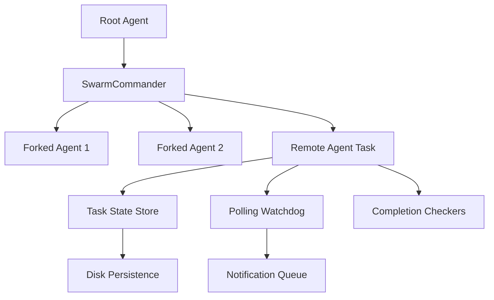

# Agent & Swarm Patterns Analysis - REDLOCK

## Component Inventory

---

### Implemented Patterns

| Pattern | Status | Location | Maturity |
|---------|--------|----------|----------|
| Forked Agent Isolation | Implemented | `server/agent.ts` | Production |
| Swarm Coordinator Orchestration | Implemented | `server/agent.ts` | Production |
| Task State Machine | Implemented | `engine/worker.ts` | Production |
| Tool Permission Boundary | Implemented | `server/agent.ts` | Production |
| Skill Bundle Loading | Implemented | `server/agent.ts` | Beta |
| Closure Service Context | Implemented | `engine/` | Beta |

---

### High Priority Patterns

| Component | Priority | Implementation Effort | Status |
|-----------|----------|---------------------|--------|
| Background Agent Resumption | CRITICAL | Medium | Pending |
| Agent Teammate Context Isolation | HIGH | Medium | Pending |
| Task Disk Persistence | HIGH | Low | Pending |
| Polling Task Watchdog | HIGH | Low | Pending |
| Subagent Context Abstraction | HIGH | Medium | Pending |
| Completion Checker Registry | MEDIUM | Low | Pending |
| Agent Session Teleport | MEDIUM | High | Pending |
| Notification Queue Manager | LOW | Low | Pending |

---

### Limitations & Constraints

#### Current Limitations

1. **No persistent task state**: All agent tasks die on process exit, no resume capability
2. **Single process only**: No remote/background agent execution
3. **No cross-session recovery**: Agents cannot continue work after CLI restarts
4. **No task notification system**: No progress heartbeat or completion alerts
5. **No subagent context isolation**: All agents share full root permissions
6. **No completion checkers**: No automated verification for long running tasks

---

### Architecture Diagram

---

### Implementation Roadmap

#### Phase 1 (Immediate)

- [ ] Implement Task Disk Persistence & Output Logging
- [ ] Port Polling Task Watchdog pattern
- [ ] Add completion checker registry interface
- [ ] Implement notification queue system

#### Phase 2 (High Priority)

- [ ] Remote Agent Task Lifecycle base implementation
- [ ] Cross session resume / recovery mechanism
- [ ] Teammate context boundary isolation
- [ ] Subagent context creation & state inheritance

#### Phase 3 (Future)

- [ ] Session teleport protocol
- [ ] Ultraplan phase tracking
- [ ] Background worker scheduling
- [ ] Git repository integration hooks
